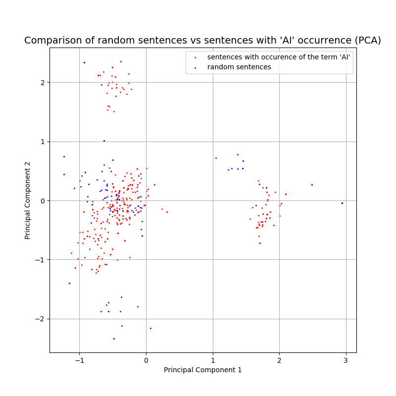

# BuzzwordsAnalyzer
Statistics about texts with occurrence of buzzwords. The prototype takes only the term "AI" as buzzword.
## Data
- https://www.kaggle.com/quora/question-pairs-dataset
- https://www.kaggle.com/hsankesara/medium-articles
## Current Results
Need to look up samples from different clusters for interpretation.
 
## References 
- stop words from: https://www.ranks.nl/stopwords
- Word representations from: T. Mikolov, E. Grave, P. Bojanowski, C. Puhrsch, A. Joulin. [Advances in Pre-Training Distributed Word Representations](https://arxiv.org/abs/1712.09405)