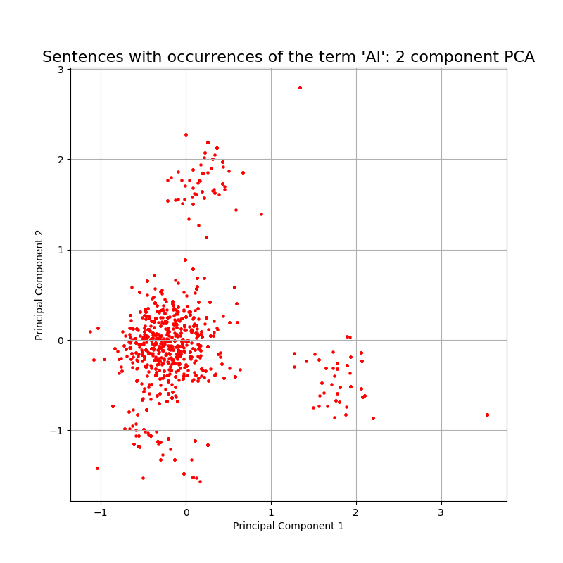

# BuzzwordsAnalyzer
Statistics about texts with occurence of buzzwords. The prorotype takes only the term "AI" as buzzword.
## Data
- https://www.kaggle.com/quora/question-pairs-dataset
- https://www.kaggle.com/hsankesara/medium-articles
## First Results
Note: The results are not carefully checked yet. That's why a comparison with "normal" sentences is needed.
 
## References 
Word representations from: T. Mikolov, E. Grave, P. Bojanowski, C. Puhrsch, A. Joulin. [Advances in Pre-Training Distributed Word Representations](https://arxiv.org/abs/1712.09405)